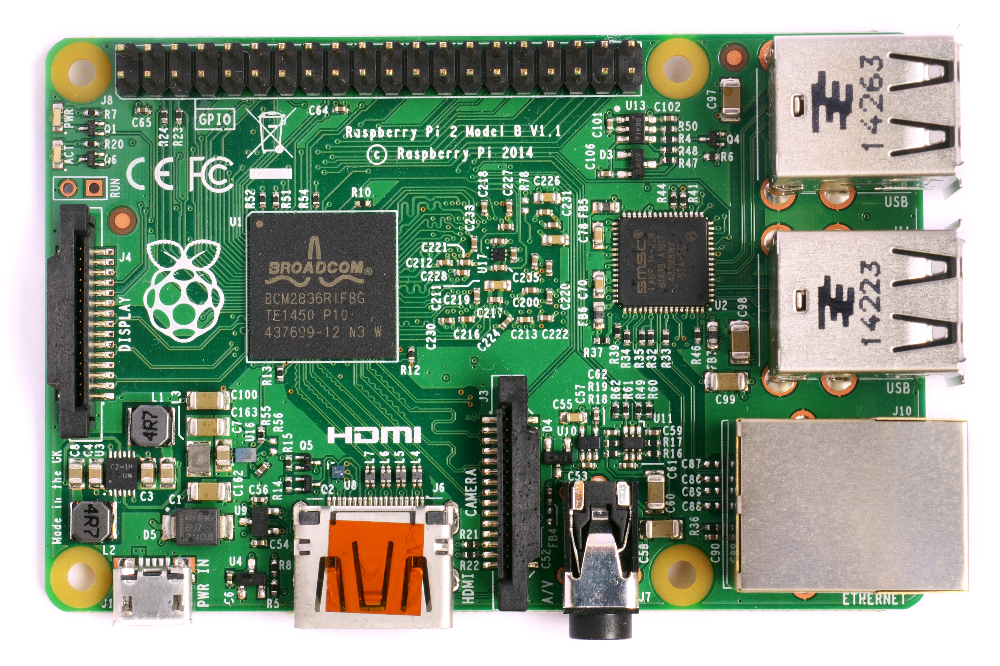
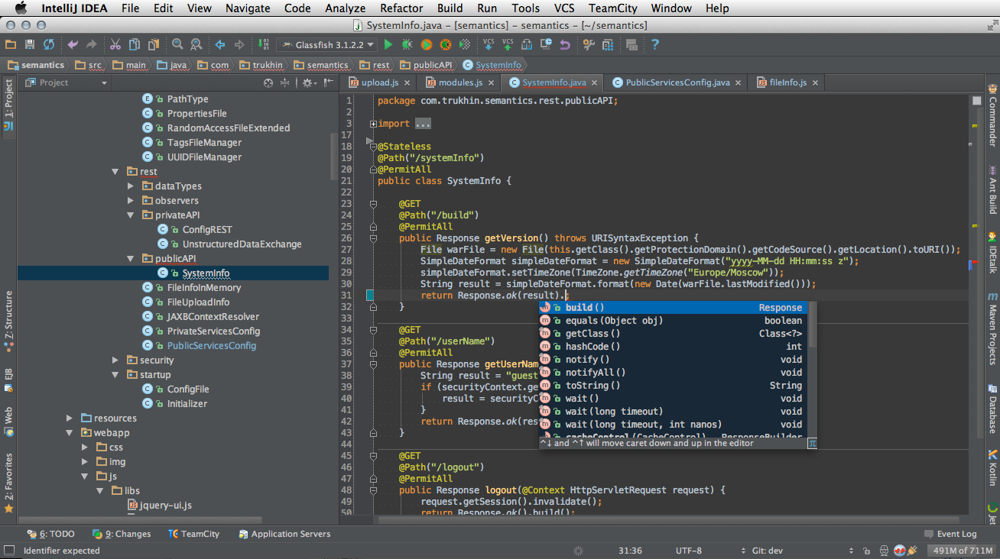

# Nivel  0 (6-9 años):

## Introducción a la programación (24h)
* Programción básica: Code.org
* Scratch

# Nivel 1 (10-14 años):

## Arduino básico (32h)
* Programación de Arduino con bloques (Bitbloq)
* Proyectos  sencillos con Arduino

## Programación Android con App Inventor (24h)
Creación de aplicaciones Android con bloques  (App Inventor)

## Impresión y Diseño 3D (24h)
* Heramientas sencillas de diseño (BloqScad y Thinkercad )
* Software de manejo de la impresoras 3D
* Mantenimiento básico

## Raspberry Pi (20h)
Montaje, instalación y uso de Rapsberry Pi

# Nivel 2 (15-18 años):

## Proyectos robóticos con Arduino (64h)
Realización de proyectos robóticas basados en Arduino a partir de una serie de plantillas de proyectos ya realizados.

## Montaje y mantenimiento de impresoras (24h)
* Montaje de una impresora 3D
* Ampliación y actualización de las capacidades de la impresora 3D

## Diseño 3D (32h)
Uso de herramientas avanzadas
* Freecad: diseño aditivo
* OpenScad: diseño algorítmico

## Programación en Raspberry Pi (40h)
* Programación en Python
* Creación de aplicaciones de escritorio
* Programación de juegos

## Programación de aplicaciones Android con Java (60h)
* Creación de aplicaciones con entornos profesionales

