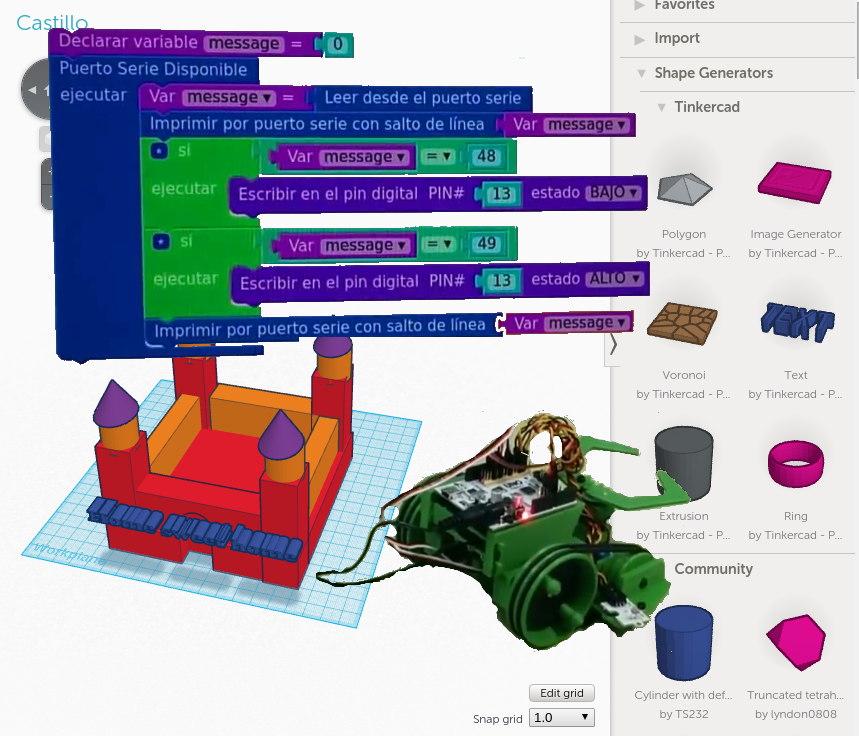
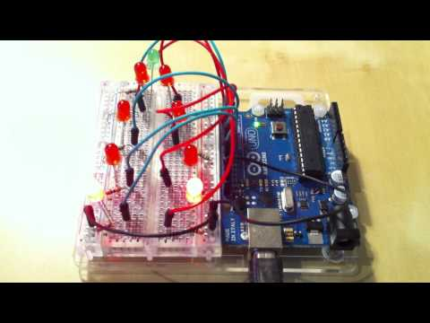

# RP3D:
## Robótica, Programación y diseño 3D como actividades extraescolares

* * *
# Temas

Podemos articular la asignatura en 3 partes fundamentales:

## Programación

Los entornos de programación tienen dificultad gradual y permiten avanzar progresivamente, permitiendo a los alumnos más avanzados o mayores.

Se utilizan entornos visuales donde la programación se basa en bloques. De hecho existen entornos de este tipo que nos permiten hacer hasta aplicaciones Android.

## Diseño e impresión 3D

Son aplicaciones sencillas orientadas a realizar operaciones sencillas para construir modelos de complejidad media, pero que introducen los conceptos esenciales y que permiten exportar el resultado para imprimirlo en 3D.

## Robótica

Si añadimos a las anteriores habilidades el  uso de módulos electrónicos sencillos, que podemos programar con entornos muy similares podemos construir robots que pueden llegar a ser muy complejos.

# Metodología

Evidentemente se hace necesario el uso del ordenador para la gran parte de las actividades. Los programas que se utilizan están prepardos para ser usados en las aulas de informática de los centros (con instalaciones de [Guadalinex](http://www.guadalinex.org/) o similar), aunque también son adaptables a sistemas windows.

Para la mayoría de las actividades **no** son necesarias muchas habilidades con el ordenador, basta con el manejo del ratón y leer con atención la pantalla.

# Proyectos

A lo largo del curso realizaremos diferentes proyectos. Se van elaborando durante varias (cada 3 aproximadamente) semanas, completándolo al final de ese tiempo.

En ellos, los niños aprenden además de los conocimientos propios de cada actividad, habilidades como la redacción de documentación,

evaluación del costes, trabajo en equipo, reparto de tareas...

# Actividades

Este es un listade de las posibles activides para 2 trimestres (28 semanas) a 2 horas semanales.

## Semanas 1-5

* Programación basica (scratch)
* Juegos Geométricos (matemáticas)

* Creamos nuestros propios dibujos (Las Tic en la asignatura de plástica)

### Proyecto: Juego

* Los entornos permiten iniciar el aprendizaje de la programación más clásica viendo el código

## Semanas 6-12

* Encender led (electricidad)
* Bucles
* Variables (series matemáticas)
* Sonido (notas musicales)

### Proyecto: Árbol de Navidad Cibernético

* Motores y engranajes	(moviento, medidas de longitud, divisores comunes)
* Reutilización de componentes (ecología)
* Evalución de costes de proyectos (economía)

### Proyecto (según las fechas)

### Halloween robótico

### Robot de reciclaje

## Semanas 13-20

* Sensor luz (Longitudes de onda, luz invisible)
* Medida de tiempo (unidades de tiempo,precisión)
* Longitudes (conversión entre unidades)
* Tipos de robots
* Partes de un robots (Anatomía animal y humana)
* Robots móvil (distancias y ángulos)

* Comportamientos:
	* Siguelíneas
	* Huyeluz

### Proyecto: Robot móvil

## Semanas 21-28

* Diseño 3D
* TinkerCad
* Figuras geométricas básicas(prismas, perspectiva, desarrollos)
* Construcción de figuras complejas por adición figuras simples (operaciones de unión, intersección)
* Llaveros, marcapáginas (plástica)
* Búsqueda de diseños en internet
* Técnicas de Impresión 3D

### Proyectos: Llaveros, adornos, marcapáginas

## Cuadro resumen de actividades:

Duración: 7 meses, 28 semanas

|semana	|Programación|Robotica|3D|
|:---:|:---:|:---:|---|
| 1-5 | x |||
| 6-12 | x |x||
| 13-20 | x |x||
| 21-28 | x |x|x|

# Inglés

Existe la posibilidad de realizar algunas de las actividades en Inglés
