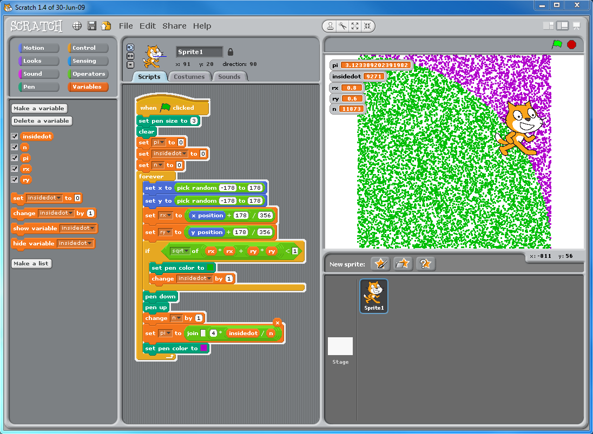

# Temas

Podemos articular la asignatura en 3 partes fundamentales:

### Programación

### Diseño e impresión 3D

### Robotica

# Metodología

Evidentemente se hace necesario el uso del ordenador para la gran parte de las actividades. Los programas que se utilizan están prepardos para ser usados en las aulas de informática de los centros (con instalaciones de [Guadalinex](http://www.guadalinex.org/) o similar), aunque también son adaptables a sistemas windows.

Para la mayoría de las actividades **no** son necesarias muchas habilidades con el ordenador, basta con el manejo del ratón y leer con atención la pantalla.

Los entornos de programación tienen dificultad gradual y permiten avanzar progresivamente, permitiendo a los alumnos más avanzados o mayores.

# Proyectos

A lo largo del curso realizaremos diferentes proyectos. Se van elaborando durante varias (cada 3 aproximadamente) semanas, completándolo al final de ese tiempo.

En ellos se aplican los conocimientos propios de cada actividad además de habilidades como la redacción de documentación, evaluación del costes, trabajo en equipo, reparto de tareas...

# Actividades

## Semanas 1-5 

* Programación basica (scratch)
* Juegos Geométricos (matemáticas)

* Creamos nuestros propios dibujos (Las Tic en la asignatura de plástica)

### Proyecto: Juego

* Los entornos permiten iniciar el aprendizaje de la programación más clásica viendo el código

## Semanas 6-12

* Encender led (electricidad)
* Bucles 
* Variables (series matemáticas)
* Sonido (notas musicales)

### Proyecto: Árbol de Navidad Cibernético

Motores y engranajes	(moviento, medidas de longitud, divisores comunes)
Reutilización de componentes (ecología)
Evalución de costes de proyectos (economía)

### Proyecto (según las fechas)

Halloween robótico

### Robot de reciclaje

13-20

Sensor luz (Longitudes de onda, luz invisible)
Medida de tiempo (unidades de tiempo,precisión)
Longitudes (conversión entre unidades)
Tipos de robots 
Partes de un robots (Anatomía animal y humana)
Robots móvil (distancias y ángulos)

Comportamientos:
	Siguelíneas
	Huyeluz

### Proyecto: Robot móvil

21-28 
Diseño 3D 
TinkerCad
	Figuras geométricas (primas, perspectiva, desarrollos)
	Llaveros, marcapáginas (plástica)

### Proyectos: Llaveros, adornos, marcapáginas

Técnicas de Impresión 3D

Duración: 7 meses, 28 semanas

|semana	|Programación|Robotica|3D|
|:---:|:---:|:---:|---|
| 1-5 | x |||
| 6-12 | x |x||
| 13-20 | x |x||
| 21-28 | x |x|x|

# Temas a pensar

¿Inglés?
¿Actividades externas al cole?

