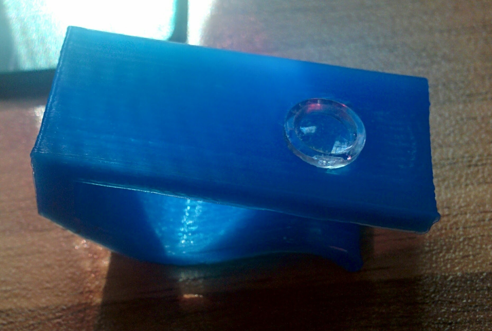

Se trata de ver usos de los cada vez más potentes actuales smartphones como instrumentos opticos

La tecnología que nos rodea:

* Por un lado tenemos unos dispositivos dotados de buenas camaras y gran capacidad de procesamiento.
* Podemos crear y  distribuir aplicaciones para ellos fácilmente
* Podemos dar vida a nuestras ideas por medio de las  impresoras 3D

Algunos ejemplos:

## [Microscopio de lente](http://www.thingiverse.com/thing:1044368)

Se añade como una pinza al teléfono y la lente hace que la cámara se convierta en un microscopio

# Telescopio (para mostrar el proyecto)

[descripcion del proyecto](http://www.xataka.com/espacio/ultrascope-es-un-telescopio-robotizado-que-podras-imprimirte-en-3d-y-que-usa-un-lumia-1020)

## [Microscopio](http://www.thingiverse.com/thing:77450)

## [Otro mircoscopio](http://www.thingiverse.com/thing:822315)

##[Cardboard](https://www.google.com/get/cardboard/)

Herramientas para poder hacer Realidad Virtual prácticamente sin coste
[cómo hacerlo](http://www.xatakandroid.com/gadgets-android/como-construir-nuestro-propio-cardboard)

[Aplicaciones para ver en Cardboard](http://www.androidauthority.com/best-google-cardboard-vr-apps-and-games-622766/)

# Proyector de hologramas

[vídeo](https://www.youtube.com/watch?v=7YWTtCsvgvg&index=1&list=PLDxBiw1MlK6RhBFmdO5gY2l_aukufp2r2)

A partir la caja de un CD podemos hacer un proyector de hologramas que usa nuestro smarphone como proyector

[Tutorial](https://goo.gl/photos/z8uN3gb92ktSxc2a6)
